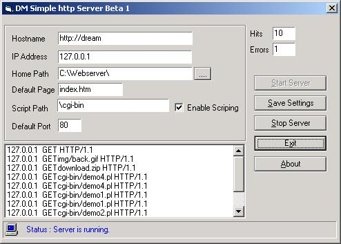



## DM WebServer Beta1

### Description

Hi fellow programmers this is my third attempt oa makeing a webserver anyway this one has now got simple sopport to run perl script at this point it will only do simple things no form posting requests as of yet but am working on it also you can edit your own custom error pages. anyway I hope you like it please , please if you have any idea or code you like to add or were You think I might have gone wrong then please do so as I like to see this become a real web server one day that we can all us and share. I will be doing a update quite soon so keep an eay out for it...... please vote if you like this code.

bye
 
### More Info
 

             |
---                |---
**Submitted On**   |2001-07-20 20:29:30
**By**             |[dreamvb](https://github.com/Planet-Source-Code/PSCIndex/blob/master/ByAuthor/dreamvb.md)
**Level**          |Beginner
**User Rating**    |4.2 (25 globes from 6 users)
**Compatibility**  |VB 5\.0, VB 6\.0
**Category**       |[Internet/ HTML](https://github.com/Planet-Source-Code/PSCIndex/blob/master/ByCategory/internet-html__1-34.md)
**World**          |[Visual Basic](https://github.com/Planet-Source-Code/PSCIndex/blob/master/ByWorld/visual-basic.md)
**Archive File**   |[DM WebServ25900942001\.zip](https://github.com/Planet-Source-Code/dreamvb-dm-webserver-beta1__1-26969/archive/master.zip)

